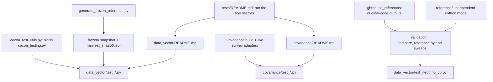

# Tests

The DES cluster tests are divided into two sectors.

- [Data-vector and likelihood checks](data_vector/README.md) cover the project
  predictions, frozen inputs and numerical diagnostics.
- [Covariance checks](covariance/README.md) cover forecast assembly and its
  documented component checks. Covariance generation must be compiled.



Read this page first, then the guide of the sector to run. The data-vector
tests read the frozen snapshot, which `generate_frozen_reference.py` writes
and `manifest_sha256.json` protects, through the shared machinery that
`cocoa_test_utils.py` binds; the exception is `test_neutrino_cb.py`, which
builds its state from the live likelihood and dataset through
`validation/compare_reference.py` and the `reference/` modules. The
covariance tests need the covariance build and read the live survey
adapters in `covariance/`. pytest does not collect `reference/`,
`validation/` and `lighthouse_reference/` by default; the
[project README](../README.md#des_cluster_validation) describes these
validation tools.

These steps assume Cocoa and this project are installed, the Cocoa Conda environment
is active, the shell is Bash, and the current folder is `cocoa/Cocoa/`.

Run the sectors in separate Python invocations: they initialize different
compiled-library state. Running one project at a time also avoids importing
another project's same-named test helpers.

**Step :one:**: activate Cocoa.

```bash
source start_cocoa.sh
```

**Step :two:**: run the data-vector sector.

```bash
python -m pytest ./projects/des_cluster/tests/data_vector
```

**Step :three:**: enable covariance generation.

```bash
unset IGNORE_COSMOLIKE_DES_CLUSTER_COVARIANCE
```

**Step :four:**: compile the project.

```bash
source ./projects/des_cluster/scripts/compile_des_cluster.sh
```

**Step :five:**: run the covariance sector.

```bash
python -m pytest ./projects/des_cluster/tests/covariance
```

The project must be enabled in `set_installation_options.sh` before
activation. A covariance skip in a deliberately disabled build is expected;
it is not a successful covariance check. Read the sector guide to distinguish
asserted regressions from advisory accuracy reports.

Frozen configurations and inputs are protected by `manifest_sha256.json`.
Do not regenerate references to silence an unexplained failure. The
[data-vector guide](data_vector/README.md#refreeze) documents the deliberate
reference-update procedure and its limits; the covariance sector stores no
reference values.

Hybrid examples can be checked without sampling:

**Step :one:**: check configuration 1.

```bash
python ./projects/des_cluster/EXAMPLE_EMUL2_MINIMIZE1.py --check
```

**Step :two:**: check configuration 2.

```bash
python ./projects/des_cluster/EXAMPLE_EMUL2_MINIMIZE2.py --check
```
